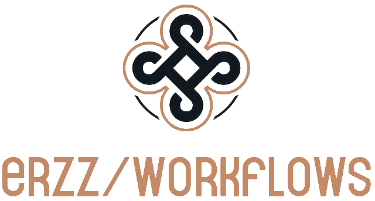

# erzz / workflows

Reusable workflows for Github Actions

## Documentation

[Full documentation is here](https://erzz.github.io/workflows)

# Available Workflows

Below is a list of the available (and planned) workflows as I work through them.

The workflows themselves can be found under [.github/workflows](/.github/workflows). They MUST live there otherwise they cannot be called by other projects which is a shame - things would be more organised if Github allowed them to live under any path :(.

Please refer to the [Docs](https://erzz.github.io/workflows) for each workflow's usage instructions.

| Workflow                                                      | Purpose                                                  | Summary of jobs                                             |
| ------------------------------------------------------------- | -------------------------------------------------------- | ----------------------------------------------------------- |
| [container](/.github/workflows/container.yml)                 | Build, push and test container images                    | Build & Push -> Hadolint & Dockle Lint & Trivy Image Scan   |
| [container-oidc](/.github/workflows/container-oidc.yml)       | As above but using OIDC authentication                   | Build & Push -> Hadolint & Dockle Lint & Trivy Image Scan   |
| deploy-cloud-run                                              | Coming Soon                                              | Coming Soon                                                 |
| deploy-cloud-function                                         | Coming Soon                                              | Coming Soon                                                 |
| [go-tests](/.github/workflows/go-tests.yml)                   | Test Go project for functionality & quality              | Code Quality, gosec SAST and Unit Tests                     |
| [java-tests](/.github/workflows/java-tests.yml)               | Test Java Maven project for functionality & quality      | Code Quality, Polaris SAST and Unit Tests                   |
| [node-tests](/.github/workflows/node-tests.yml)               | Test NodeJS project for functionality & quality          | ESLint, njsscan(SAST) and Unit Tests                        |
| [semantic-release](/.github/workflows/release.yml)            | Create releases based on semantic commits                | Semantic-release using this repository's config or your own |
| [source-protection](/.github/workflows/source-protection.yml) | Check commits for credentials and commit conventions     | Gitleaks, STACS & CommitLint                                |
| terraform-apply                                               | Coming Soon                                              | Coming Soon                                                 |
| [terraform-tests](/.github/workflows/terraform-tests.yml)     | Tests and plans an environment's terraform configuration | tfsec, tflint, terraform validate, & terraform plan         |
