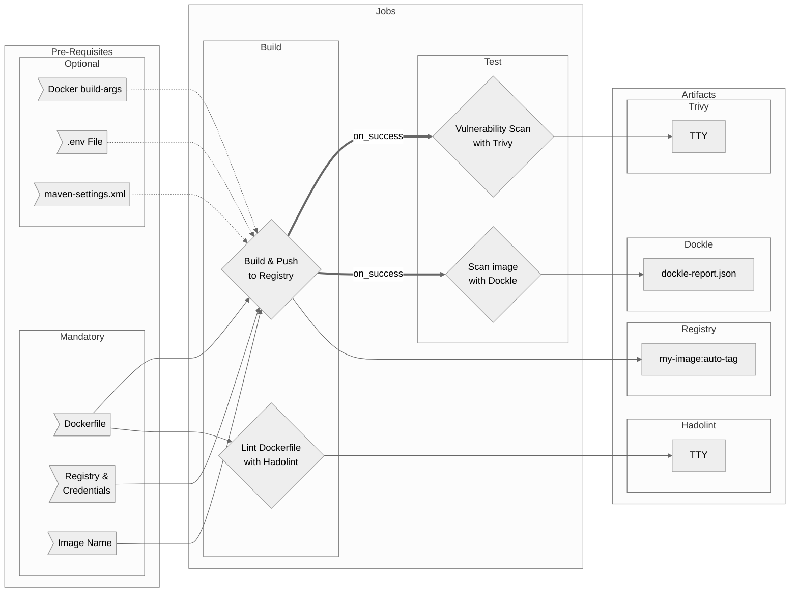

# Container Workflow Overview

## Purpose

Container workflows aim to build container images, push to a registry and test the container / Dockerfile for security issues and best practices.

There are two versions of the workflow:

- `container.yml` uses standard authentication with the registry using basic credentials, service account keys etc
- `continer-oidc.yml` (recommended) uses OIDC authentication between Github and GCP

## Included Jobs

### Build & Push to Registry

Builds a container image from Dockerfile and pushes to a registry of your choice. Incorporates automatic gitops-like tagging based on branch/tag/release.

**Uses:** [mr-smithers-excellent/docker-build-push@v5](https://github.com/mr-smithers-excellent/docker-build-push)

## Hadolint

Lints the Dockerfile for best practices, minimisation tips and potential security issues

**Uses:** [hadolint/hadolint-action@v1.6.0](https://github.com/hadolint/hadolint-action)

## Trivy Image Scan

Excellent & very fast image scanner that finds vulnerabilities in OS packages and common language dependencies such as Node/Go/Java etc.

**Uses:** [aquasecurity/trivy-action@master](https://github.com/aquasecurity/trivy-action)

## Dockle

Runs a overlapping yet significantly different, set of security checks and best practice checks to Hadolint - with a focus on the final image as opposed to just the Dockerfile

**Uses:** [erzz/dockle-action@v1.1.1](https://github.com/erzz/dockle-action)