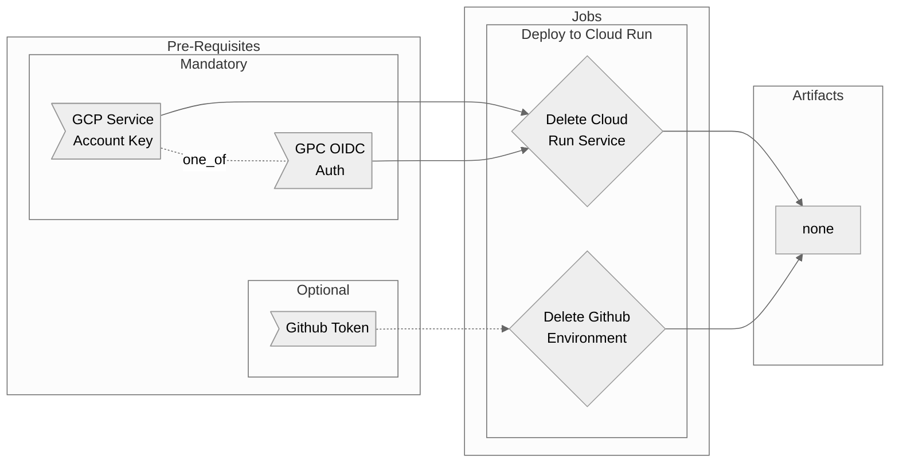

# Delete Cloud Run Workflow Overview

## Purpose

This workflow simply removes a Cloud Run deployment along with any Github environment created with it. It's most commonly used in branch cleanup context where you wish to delete a preview environment after merge or closing of the branch.

- Deletes the named Cloud Run service
  - Supports either OIDC or GCP Service Account key for authentication
  - By default the job doesn't fail if it finds no service with the name
- Option (default true) to delete an associated Github environment

## Included Jobs



### Delete Cloud Run Service

Uses simple gcloud commands to check if service exists and delete it if found. 

**Uses:**
  - [google-github-actions/auth@v0](https://github.com/google-github-actions/auth)
  - `gcloud run services delete --quiet --platform managed ${{ inputs.cr-service-name }} --region ${{ inputs.cr-region }} --project ${{ secrets.cr-project-id }}`

### Delete Github Environment

Simple job that removes any environment by name from the Github UI.

**Uses:** [strumwolf/delete-deployment-environment@v2](https://github.com/strumwolf/delete-deployment-environment)


## Usage

!> You must select a type of authentication using either `gcp-sa-auth: true` or `gcp-oidc-auth: true`

As the most likely case for using this job is in the event of a branch being deleted, that is the case demonstrated here.

### Basic (OIDC Authentication)

Essentially the job just needs authentication plus the name & region of the service. 

```yaml
name: Cleanup Feature Branch
on:
  delete:
    branches-ignore:
      - main
      - master
jobs:
  delete:
    uses: erzz/workflows/.github/workflows/delete-cloudrun.yml@main
    with:
      gcp-oidc-auth: true
      cr-service-name: ${{ github.ref_name }}-${{ github.event.repository.name }}
      cr-region: europe-north1
      gh-env-name: test-branch1
    secrets:
      wip: projects/012345678901/locations/global/workloadIdentityPools/github/providers/github
      service-account: my-service-account@my-project.iam.gserviceaccount.com
      cr-project-id: my-gcp-project
      token: ${{ secrets.GITHUB_PAT }}
```

### Basic (SA Key Authentication)

If using SA Key authentication then replace `gcp-oidc-auth: true` with `gcp-sa-auth: true` and provide the service account's JSON key as a secret

```yaml
name: Cleanup Feature Branch
on:
  delete:
    branches-ignore:
      - main
      - master
jobs:
  delete:
    uses: erzz/workflows/.github/workflows/delete-cloudrun.yml@main
    with:
      gcp-sa-auth: true
      cr-service-name: ${{ github.ref_name }}-${{ github.event.repository.name }}
      cr-region: europe-north1
      gh-env-name: test-branch1
    secrets:
      service-account-key: ${{ secrets.DEV_GCP_DEPLOY_SA }}
      cr-project-id: my-gcp-project
      token: ${{ secrets.GITHUB_PAT }}
```

## Secrets

| Input                 | Required      | Details                                                                                             |
| --------------------- | ------------- | --------------------------------------------------------------------------------------------------- |
| `wip`                 | for OIDC auth | The workload identity provider to use if OIDC Authentication with GCP is required to run unit tests |
| `service-account`     | for OIDC auth | The service account to impersonate if OIDC Authentication with GCP is required to run unit tests    |
| `service-account-key` | for SA auth   | The service account JSON to use if SA JSON key auth with GCP is required to run unit tests          |
| `cr-project-id`       | true          | The GCP project in which to delete your Cloud Run service                                           |
| `token`               | false         | The Github token to use for github environment deletion if `gh-env-delete` is enabled.              |

## Inputs

| Input             | Required | Default        | Details                                                                                         |
| ----------------- | -------- | -------------- | ----------------------------------------------------------------------------------------------- |
| `gcp-sa-auth`     | depends  | `false`        | Set to `true` to enable GCP Service Account Key authentication                                  |
| `gcp-oidc-auth`   | depends  | `false`        | Set to `true` to enable GCP OIDC authentication                                                 |
| `cr-service-name` | true     | N/A - Required | The name of the cloud run service to delete                                                     |
| `cr-region`       | true     | N/A - Required | The GCP region in which to delete the service                                                   |
| `gh-env-delete`   | false    | `true`         | Should the job also attempt to delete the associated environment in Github                      |
| `gh-env-name`     | false    | `""`           | The name of the github environment to delete if gh-env-delete is enabled                        |
| `fail-job`        | false    | `0`            | The exit code to use if service to delete is not found. Setting `1` will produce a job failure. |

## Outputs

None at this time

## Advanced Examples

### Without Github Environment deletion

Simply add `inputs.gh-env-delete: false` and there is no need to provide `secrets.token` as it's no longer required

```yaml
delete:
  uses: erzz/workflows/.github/workflows/delete-cloudrun.yml@main
  with:
    gcp-oidc-auth: true
    cr-service-name: ${{ github.ref_name }}-${{ github.event.repository.name }}
    cr-region: europe-north1
    gh-env-delete: false
  secrets:
    wip: projects/012345678901/locations/global/workloadIdentityPools/github/providers/github
    service-account: my-service-account@my-project.iam.gserviceaccount.com
    cr-project-id: my-gcp-project
```

### Fail if service not found

Set the exit code of the job in the event of failure by adding `fail-job: 1` or any other value of your choice

```yaml
delete:
  uses: erzz/workflows/.github/workflows/delete-cloudrun.yml@main
  with:
    gcp-oidc-auth: true
    cr-service-name: ${{ github.ref_name }}-${{ github.event.repository.name }}
    cr-region: europe-north1
    gh-env-name: test-branch1
    fail-job: 1
  secrets:
    wip: projects/012345678901/locations/global/workloadIdentityPools/github/providers/github
    service-account: my-service-account@my-project.iam.gserviceaccount.com
    cr-project-id: my-gcp-project
    token: ${{ secrets.GITHUB_PAT }}
```
