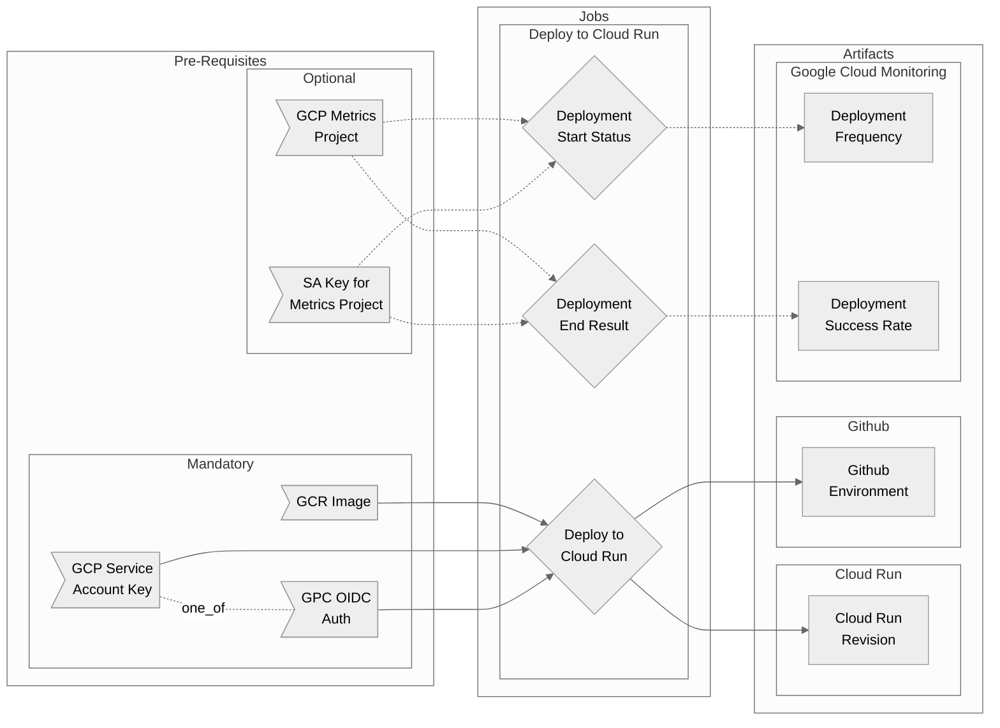

# Deploy to Cloud Run Workflow Overview

## Purpose

This workflow will perform a Cloud Run deployment with the option to also ping Deployment Metrics to Google Cloud Monitoring.

?> The workflow depends on having a container image built. Use your own jobs or use the [container workflows](container/README.md).

- Deploys one or more services to Cloud Run
  - Option for authenticating with OIDC
  - Option for authenticating with Service Account keyfile
  - Configurable flags, environment variables and naming
  - Creates Github Environment with link to deployed service
- Optionally send deployment metrics to Google Cloud Monitoring

## Included Jobs



### Deploy to Cloud Run

Makes a deployment to cloud run creating either a new service or updating an existing one with a new revision. All Cloud Run's flags can be exposed to specify CPU, VPC connectors, traffic management etc. 

If opting in to also creating deployment metrics, it will also ping a GCP project (which could be the same as the one you are deploying to or any other) with metric payloads including things like result, team, service, version etc.

**Uses:** 
  - [erzz/google-dep-metrics@v1.0.1](https://github.com/erzz/google-dep-metrics)
  - [google-github-actions/auth@v0](https://github.com/google-github-actions/auth)
  - [google-github-actions/deploy-cloudrun@main](https://github.com/google-github-actions/deploy-cloudrun)


## Usage

Of course there are many variations that may be required for a deployment but most of them can be handled by either `inputs.cr-flags` or `secrets.cr-env-vars`. 

!> Note that `env-vars` is a secret because there is a high likelihood of including sensitive values.

!> You must select a type of authentication using either `gcp-sa-auth: true` or `gcp-oidc-auth: true`

### Basic (without deployment metrics)

The simplest scenario would produce the following deployment:

- Cloud Run Service named after your Github repository
- Image taken from the outputs of the [Container Workflow](container/README.md)
- Simple Service Account Key authentication (recommend OIDC auth instead)
- Deployed in Region europe-west3
- 1 CPU, 1Gb RAM, Port 8080, Scale to zero, max 1 instance, timeout 5m and no unauthenticated access
- No deployment metrics
- A github environment created and named after the branch

```yaml
deploy:
  needs: build
  uses: erzz/workflows/.github/workflows/deploy-cloudrun.yml@main
  needs: build
  with:
    gcp-sa-auth: true
    cr-image: ${{ needs.build.outputs.image-name }}:${{ needs.build.outputs.image-tag }}
    cr-region: europe-west3
  secrets:
    service-account-key: ${{ secrets.DEPLOY_SA_KEY }}
    cr-project-id: my-gcp-project
```

### Basic (with deployment metrics)

The metrics payload sent to GCM looks like:

```
metric
  labels
    key: "environment"
    value: "my-branch"
  labels
    key: "result"
    value: "pending"
  labels
    key: "service"
    value: "my-application"
  labels
    key: "status"
    value: "started"
  labels
    key: "team"
    value: "my-team"
  labels
    key: "version"
    value: "v1.2.3"
  type: "custom.googleapis.com/deployment/status"
resource
  type: "global"
points
  interval
    end_time
      seconds: 1642604192
      nanos: 435875654
  value
    int64_value: 1
```

?> All values can be customised by your inputs - but only `team` and `version` require values to get started

To enable metrics something like the following would be the simplest case:

```yaml
deploy:
  needs: build
  uses: erzz/workflows/.github/workflows/deploy-cloudrun.yml@main
  needs: build
  with:
    gcp-sa-auth: true
    cr-image: ${{ needs.build.outputs.image-name }}:${{ needs.build.outputs.image-tag }}
    cr-region: europe-west3
    metrics: true
    metrics-team: my-team
    metrics-version: ${{ needs.build.outputs.image-tag }}
  secrets:
    service-account-key: ${{ secrets.DEPLOY_SA_KEY }}
    cr-project-id: my-gcp-project
    metrics-gcp-project: my-gcp-project
    metrics-sa-key: ${{ secrets.METRICS_KEY }}
```

## Secrets

| Input                 | Required      | Details                                                                                             |
| --------------------- | ------------- | --------------------------------------------------------------------------------------------------- |
| `wip`                 | for OIDC auth | The workload identity provider to use if OIDC Authentication with GCP is required to run unit tests |
| `service-account`     | for OIDC auth | The service account to impersonate if OIDC Authentication with GCP is required to run unit tests    |
| `service-account-key` | for SA auth   | The service account JSON to use if SA JSON key auth with GCP is required to run unit tests          |
| `cr-project-id`       | true          | The GCP project in which to deploy your Cloud Run service                                           |
| `cr-env-vars`         | false         | Comma seperated list of KEY=value environment variables for the cloud run deployment to use         |
| `metrics-gcp-project` | false         | The GCP project to which deployment metrics should be sent                                          |
| `metrics-sa-key`      | false         | A service account key with role monitoring.admin in the `metrics-gcp-project`                       |

## Inputs

| Input                 | Required | Default                                                                                                                            | Details                                                                                 |
| --------------------- | -------- | ---------------------------------------------------------------------------------------------------------------------------------- | --------------------------------------------------------------------------------------- |
| `gcp-sa-auth`         | depends  | `false`                                                                                                                            | Set to `true` to enable GCP Service Account Key authentication                          |
| `gcp-oidc-auth`       | depends  | `false`                                                                                                                            | Set to `true` to enable GCP OIDC authentication                                         |
| `cr-service-name`     | disabled | `${{ github.event.repository.name }}`                                                                                              | The name to give to the cloud run service                                               |
| `cr-image`            | true     | N/A - Required                                                                                                                     | Set to false if you want to use your own .codeclimate.yml config                        |
| `cr-region`           | true     | N/A - Required                                                                                                                     | Set relative path to your own code climate configuration if `cc-default-config`=`false` |
| `cr-suffix`           | false    | `""`                                                                                                                               | Max number of INFO Code Climate findings allowed before forcing a failed result         |
| `cr-flags`            | false    | `--port 8080 --cpu 1 --memory 1024Mi --timeout 5m --concurrency 80 --min-instances 0 --max-instances 1 --no-allow-unauthenticated` | Additional cloud run flags to apply during deployment                                   |
| `gh-env-name`         | false    | `${{ github.ref_name }}`                                                                                                           | The name to give to the environment created in Github                                   |
| `metrics`             | false    | `false`                                                                                                                            | Max number of MAJOR Code Climate findings allowed before forcing a failed result        |
| `metrics-team`        | false    | `""`                                                                                                                               | Max number of CRITICAL Code Climate findings allowed before forcing a failed result     |
| `metrics-service`     | false    | `${{ github.event.repository.name }}`                                                                                              | Max number of BLOCKER Code Climate findings allowed before forcing a failed result      |
| `metrics-environment` | false    | `${{ github.ref_name }}`                                                                                                           | Set to false if you want to use your own `.gosec-config.json`                           |
| `metrics-version`     | false    | `""`                                                                                                                               | Set a custom path for gosec to scan if required                                         |

## Outputs

| Output | Description                          | Example value                                   |
| ------ | ------------------------------------ | ----------------------------------------------- |
| `url`  | The full URL to the deployed service | `https://my-service-abcdefghijkl-lz.a.run.app/` |

## Advanced Examples

### Full Complex Example

Uses every input and secret with OIDC auth. Example uses mostly dynamic values that utilise github context and/or outputs from previous jobs for inspiration.

```yaml
deploy:
  needs: [ build, go-tests, source-protection ]
  uses: erzz/workflows/.github/workflows/deploy-cloudrun.yml@main
  needs: build
  with:
    gcp-oidc-auth: true
    cr-service-name: ${{ github.event.repository.name }}
    cr-image: ${{ needs.build.outputs.image-name }}:${{ needs.build.outputs.image-tag }}
    cr-region: europe-north1
    cr-suffix: ${{ needs.build.outputs.image-tag }}
    cr-flags: "--port 8080 --cpu 4 --memory 2048Mi --timeout 5m --concurrency 80 --min-instances 1 --max-instances 100 --service-account app-service-account@my-gcp-project.iam.gserviceaccount.com --allow-unauthenticated --vpc-connector my-vpc-connector"
    metrics: true
    metrics-team: my-team
    metrics-service: ${{ github.event.repository.name }}
    metrics-environment: ${{ github.ref_name }}
    metrics-version: ${{ needs.build.outputs.image-tag }}
  secrets:
    wip: projects/123456789000/locations/global/workloadIdentityPools/github/providers/github
    service-account: my-ci-service-account@my-project-id.iam.gserviceaccount.com
    cr-project-id: my-gcp-project
    metrics-gcp-project: my-gcp-project
    metrics-sa-key: ${{ secrets.METRICS_KEY }}
```
