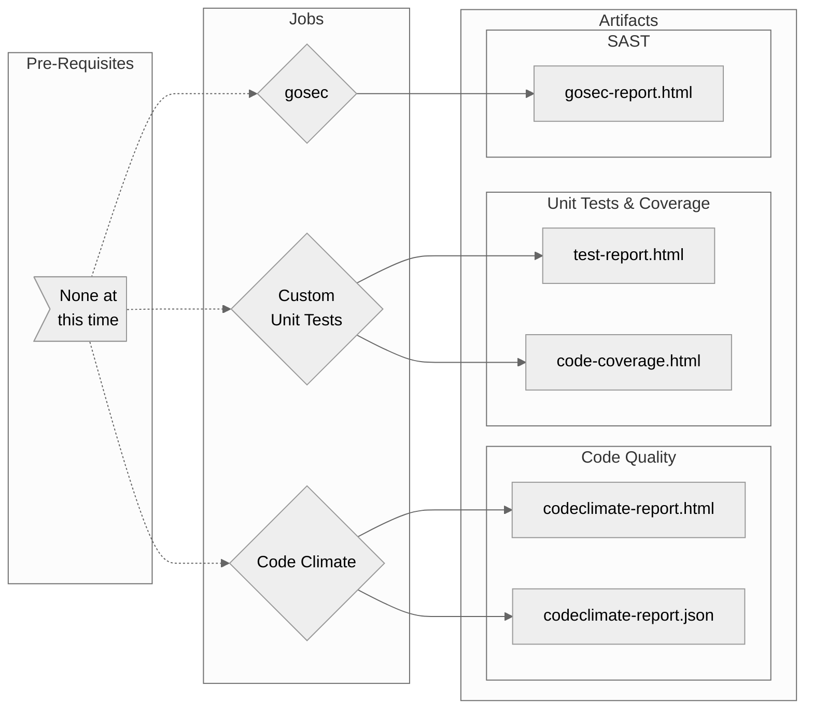

# Go-Tests Workflow Overview

## Purpose

This workflow will execute tests on your Go application that require only the code (i.e. no deployed environment).

In general it will run your Unit (`go test`), gosec (SAST) and Code Quality tests for the build.

- General
  - Configurable Go version (disabled temporarily for an issue between reusable workflows and the setup-go action)
- Code Quality
  - Provides a default configuration with the option to use your own
  - Provides HTML report as an artifact
- gosec (SAST)
  - Provides a default configuration with the option to use your own
  - Provides an HTML report as an artifact
- Unit Tests
  - Provides HTML reports for the tests themselves and for code coverage

## Included Jobs

### Code Climate Standalone

Runs a version of Code Climate that requires no subscription or server connection. Just executes locally using either this workflow's configuration or you own to identify code quality, consistency and good practice.

**Uses:** [erzz/codeclimate-standalone@v0.0.3](https://github.com/erzz/codeclimate-standalone)

### Gosec

Inspects source code for security problems by scanning the Go AST.

**Uses:** [securego/gosec@master](https://github.com/securego/gosec)

### Unit Tests

Runs `go test` with tweaks to produce code coverage and results reports

**Uses:** N/A Your own Go tests