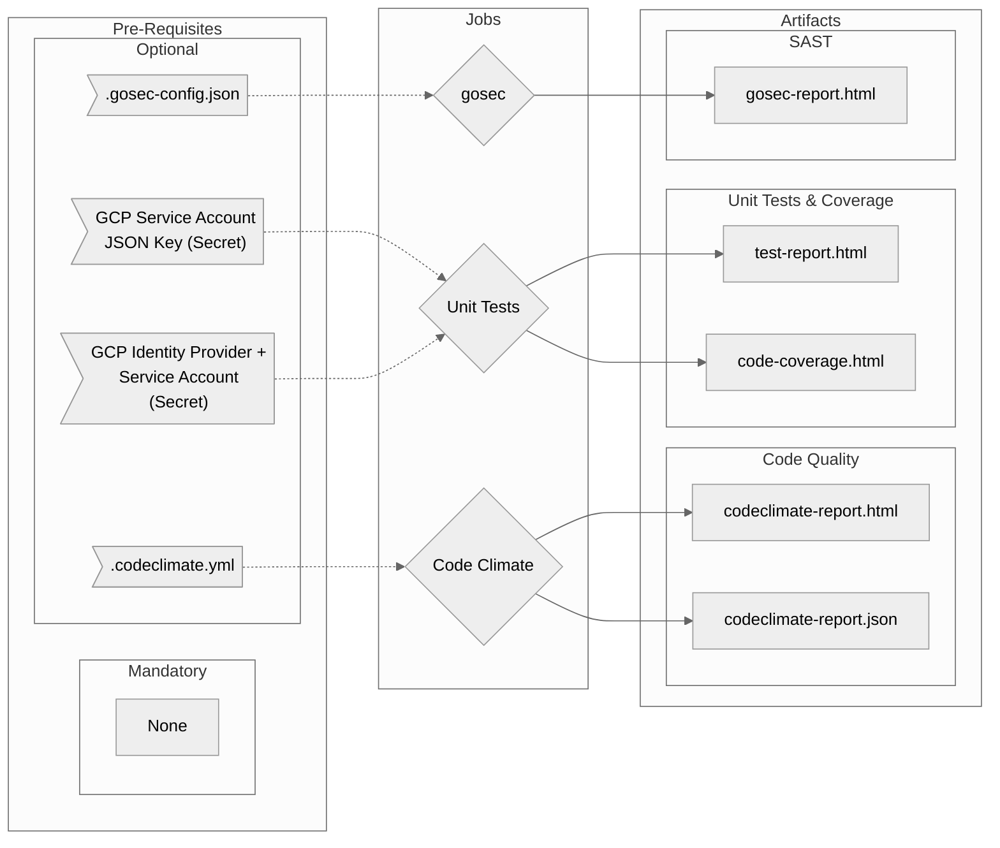

# Go-Tests Workflow Overview

## Purpose

This workflow will execute tests on your Go application that require only the code (i.e. no deployed environment).

In general it will run your Unit (`go test`), gosec (SAST) and Code Quality tests for the build.

- General
  - Configurable Go version (disabled temporarily for an issue between reusable workflows and the setup-go action)
- Code Quality
  - Provides a default configuration with the option to use your own
  - Provides HTML report as an artifact
- gosec (SAST)
  - Provides a default configuration with the option to use your own
  - Provides an HTML report as an artifact
- Unit Tests
  - Provides HTML reports for the tests themselves and for code coverage

## Included Jobs



### Code Climate Standalone

Runs a version of Code Climate that requires no subscription or server connection. Just executes locally using either this workflow's configuration or you own to identify code quality, consistency and good practice.

**Uses:** [erzz/codeclimate-standalone@v0.0.3](https://github.com/erzz/codeclimate-standalone)

### Gosec

Inspects source code for security problems by scanning the Go AST.

**Uses:** [securego/gosec@master](https://github.com/securego/gosec)


### Unit Tests

Runs `go test` with tweaks to produce code coverage and results reports

**Uses:** N/A Your own Go tests

## Usage

Go provides great tooling out of the box and thus you can likely use something as simple as:

```yaml
go-tests:
  uses: erzz/workflows/.github/workflows/go-tests.yml@go-tests
```

## Secrets

| Input                  | Required      | Details                                                                                             |
| ---------------------- | ------------- | --------------------------------------------------------------------------------------------------- |
| `wip`                  | for OIDC auth | The workload identity provider to use if OIDC Authentication with GCP is required to run unit tests |
| `service-account`      | for OIDC auth | The service account to impersonate if OIDC Authentication with GCP is required to run unit tests    |
| `service-account-key`  | for SA auth   | The service account JSON to use if SA JSON key auth with GCP is required to run unit tests          |

## Inputs

!> the `go-version` input is currently disabled due to an issue with the `setup-go` action within reusable workflows.

| Input                   | Required | Default            | Details                                                                                        |
| ----------------------- | -------- | ------------------ | ---------------------------------------------------------------------------------------------- |
| `gcp-sa-auth`           | false    | `false`            | If GCP authentication using a service account JSON key is required for any test, set to `true` |
| `gcp-oidc-auth`         | false    | `false`            | If GCP authentication using OIDC is required for any test, set to true                         |
| `go-version`            | disabled | disabled           | Select the version of go to use. Accepts https://github.com/npm/node-semver                    |
| `cc-default-config`     | false    | `true`             | Set to false if you want to use your own .codeclimate.yml config                               |
| `cc-config-file`        | false    | `.codeclimate.yml` | Set relative path to your own code climate configuration if `cc-default-config`=`false`        |
| `cc-info-threshold`     | false    | `0`                | Max number of INFO Code Climate findings allowed before forcing a failed result                |
| `cc-minor-threshold`    | false    | `0`                | Max number of MINOR Code Climate findings allowed before forcing a failed result               |
| `cc-major-threshold`    | false    | `0`                | Max number of MAJOR Code Climate findings allowed before forcing a failed result               |
| `cc-critical-threshold` | false    | `0`                | Max number of CRITICAL Code Climate findings allowed before forcing a failed result            |
| `cc-blocker-threshold`  | false    | `0`                | Max number of BLOCKER Code Climate findings allowed before forcing a failed result             |
| `gosec-default-config`  | false    | `true`             | Set to false if you want to use your own `.gosec-config.json`                                  |
| `gosec-scan-path`       | false    | `./...`            | Set a custom path for gosec to scan if required                                                |
| `gosec-extra-flags`     | false    | `""`               | Pass any extra gosec flags here such as `-exclude=G104`                                        |
| `unit-test-path`        | false    | `./...`            | Set a custom path for the go test command if required                                          |

## Outputs

| Output      | Description                                                   | Example value   |
| ----------- | ------------------------------------------------------------- | --------------- |
| `short-sha` | Captures the short SHA for use in this or later workflow jobs | `cb26122`       |
| `ref-slug`  | A URL sanitized version of the github ref                     | `bug-mybranch1` |

## Advanced Examples

### GCP SA Auth in Unit Tests

```yaml
go-tests:
  uses: erzz/workflows/.github/workflows/go-tests.yml@go-tests
  with:
    gcp-sa-auth: true
  secrets:
    service-account-key: ${{ secrets.SA_JSON_KEY }}
```

### GCP OIDC Auth in Unit Tests

```yaml
go-tests:
  uses: erzz/workflows/.github/workflows/go-tests.yml@go-tests
  with:
    gcp-oidc-auth: true
  secrets:
    wip: projects/123456789000/locations/global/workloadIdentityPools/github/providers/github
    service-account: my-ci-service-account@my-project-id.iam.gserviceaccount.com
```

### Using a specific Go version

```yaml
go-tests:
  uses: erzz/workflows/.github/workflows/go-tests.yml@go-tests
  with:
    go-version: 1.16.2
```

### Set your own Code Quality thresholds

```yaml
go-tests:
  uses: erzz/workflows/.github/workflows/go-tests.yml@go-tests
  with:
    cc-info-threshold: 5
    cc-minor-threshold: 3
    cc-major-threshold: 0
    cc-critical-threshold: 0
    cc-blocker-threshold: 0
```
