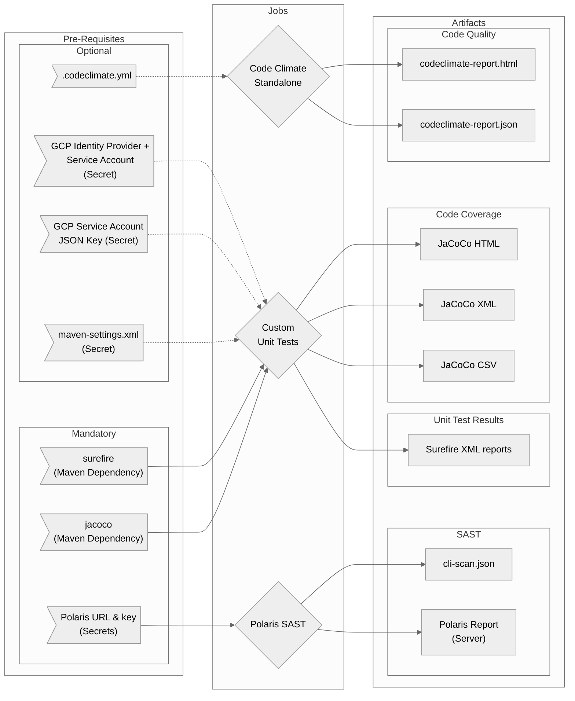

# Java-Tests Workflow Overview 

## Purpose

This workflow is, very specifically, based on a case where we are building a Maven application, possibly with a Maven settings file and possibly needing some GCP authentication elements during testing.

?>There may be other variations of this in the future - feel free to request!

In general it will run Unit Tests, Code Quality and SAST for the build.

- Code Quality using Code Climate in standalone mode
  - Default configuration or bring your own
  - Configurable Pass / Fail criteria
  - HTML report as artifact by default
- Polaris SAST Scan
  - Provides results analysis script to "break the build" on your own criteria
  - Option to include maven settings file
  - JSON report as an artifact
  - Optional usage of a maven-settings.xml
- Unit Tests
  - Option to provide GCP auth via SA key or OIDC
  - Configurable test command
  - Provides Surefire and Jacoco reports as artifacts
  - Optional usage of a maven-settings.xml

## Included Jobs



### Code Climate Standalone

Runs a version of Code Climate that requires no subscription or server connection. Just executes locally using either this workflow's configuration or you own to identify code quality, consistency and good practice.

**Uses:** [erzz/codeclimate-standalone@v0.0.3](https://github.com/erzz/codeclimate-standalone)

### Polaris SAST

!> This is a paid service and you will be expected to provide both the URL and an access key to send your results to Synopsis for analysis

SAST application that analyses your code for security issues and bad practices

**Uses:** N/A Scripted installation and execution in the workflow

### Unit Tests

!> You will need to provide your own tests. This job automates the execution of your `mvn test --fail-at-end -B` (or equivalent) command and produces reports plus coverage

Executes your Unit tests with a command of your choice and provides reports from Surefire plus Code Coverage from JaCoCo

Uses: N/A Scripted installation and execution in the workflow

## Usage

Due to the nature of the jobs in this workflow, there are many possible inputs and secrets that can be applied. The **vast majority** of them are optional!

Below is the most basic example (most common options) but please refer to the [Other Examples](java-tests/README?id=advanced-examples) section below for more combinations.

**Basic Example**

The following example would work for a build that:

- Requires no special Maven Settings file
- Requires no GCP authentication to run unit tests
- Will use the workflow-provided version of the Code Climate configuration
- Accepts only ZERO code quality issues
- Accepts only ZERO SAST findings
- Uses the command `./mvnw test --fail-at-end -Dorg.slf4j.simpleLogger.log.org.apache.maven.cli.transfer.Slf4jMavenTransferListener=warn -B` to execute the unit tests

```yaml
java-tests:
  uses: erzz/workflows/.github/workflows/java-tests.yml@main
  with:
    polaris-url: https://my-company.polaris.synopsys.com
    polaris-project-name: my-project
  secrets:
    polaris-access-token: ${{ secrets.POLARIS_ACCESS_TOKEN }}
```

As you can see, the only really mandatory configurations then are for the paid Polaris service.

## Secrets

| Input                  | Required      | Details                                                                                             |
| ---------------------- | ------------- | --------------------------------------------------------------------------------------------------- |
| `wip`                  | for OIDC auth | The workload identity provider to use if OIDC Authentication with GCP is required to run unit tests |
| `service-account`      | for OIDC auth | The service account to impersonate if OIDC Authentication with GCP is required to run unit tests    |
| `service-account-key`  | for SA auth   | The service account JSON to use if SA JSON key auth with GCP is required to run unit tests          |
| `mvn-settings-file`    | false         | If a maven settings file is required provide the secret containing the file                         |
| `polaris-access-token` | true          | An access token for posting SAST results to your Polaris Server                                     |


## Inputs

As there are many potential inputs they are broken up into separate groups here for easier reference

### Maven Inputs

| Input          | Required | Default | Details                                                                                                               |
| -------------- | -------- | ------- | -----------------------------------------------------------------------------------------------------                 |
| `mvn-settings` | false    | `true`  | If you wish to enable the use of a maven-settings.xml file set to true (and provide the contents in the secret above) |

### Code Climate Inputs

| Input                   | Required | Default            | Details                                                                                 |
| ----------------------- | -------- | ------------------ | --------------------------------------------------------------------------------------- |
| `cc-default-config`     | false    | `true`             | Set to false if you want to use your own .codeclimate.yml config                        |
| `cc-config-file`        | false    | `.codeclimate.yml` | Set relative path to your own code climate configuration if `cc-default-config`=`false` |
| `cc-info-threshold`     | false    | `0`                | Max number of INFO Code Climate findings allowed before forcing a failed result         |
| `cc-minor-threshold`    | false    | `0`                | Max number of MINOR Code Climate findings allowed before forcing a failed result        |
| `cc-major-threshold`    | false    | `0`                | Max number of MAJOR Code Climate findings allowed before forcing a failed result        |
| `cc-critical-threshold` | false    | `0`                | Max number of CRITICAL Code Climate findings allowed before forcing a failed result     |
| `cc-blocker-threshold`  | false    | `0`                | Max number of BLOCKER Code Climate findings allowed before forcing a failed result      |

### Polaris SAST Inputs

| Input                        | Required | Default            | Details                                                                                 |
| ---------------------------- | -------- | ------------------ | --------------------------------------------------------------------------------------- |
| `polaris-url`                | true     | N/A Mandatory      | Full url of the Polaris server instance e.g. `https://my-company.polaris.synopsys.com`  |
| `polaris-project-name`       | true     | N/A Mandatory      | The name of the project in Polaris to publish the results too e.g. `my-project`         |
| `polaris-low-threshold`      | false    | `0`                | Max number of LOW Polaris SAST findings allowed before forcing a failed result          |
| `polaris-medium-threshold`   | false    | `0`                | Max number of MEDIUM Polaris SAST findings allowed before forcing a failed result       |
| `polaris-high-threshold`     | false    | `0`                | Max number of HIGH Polaris SAST findings allowed before forcing a failed result         |
| `polaris-critical-threshold` | false    | `0`                | Max number of CRITICAL Polaris SAST findings allowed before forcing a failed result     |
| `polaris-total-threshold`    | false    | `0`                | Max TOTAL number of Polaris SAST findings allowed before forcing a failed result        |

### Unit Test Inputs

| Input               | Required  | Default            | Details                                                                                  |
| ------------------- | --------- | ------------------ | ---------------------------------------------------------------------------------------  |
| `gcp-sa-auth`       | false     | `false`      | If GCP authentication using a service account JSON key is required for any test, set to `true` |
| `gcp-oidc-auth`     | false     | `false`      | If GCP authentication using OIDC is required for any test, set to true                         |
| `unit-test-command` | false     | `./mvnw -s maven-settings.xml test --fail-at-end -Dorg.slf4j.simpleLogger.log.org.apache.maven.cli.transfer.Slf4jMavenTransferListener=warn -B` | To use your own command for running the unit tests, override the default command here                       |

## Outputs

None

## Advanced Examples

### Use a maven-settings.xml

```yaml
java-tests:
  uses: erzz/workflows/.github/workflows/java-tests.yml@main
  with:
    polaris-url: https://my-company.polaris.synopsys.com
    polaris-project-name: my-project
    mvn-settings: true
  secrets:
    polaris-access-token: ${{ secrets.POLARIS_ACCESS_TOKEN }}
    mvn-settings-file: ${{ secrets.MAVEN_SETTINGS_FILE }}
```

### GCP SA Auth in Unit Tests

```yaml
java-tests:
  uses: erzz/workflows/.github/workflows/java-tests.yml@main
  with:
    polaris-url: https://my-company.polaris.synopsys.com
    polaris-project-name: my-project
    gcp-sa-auth: true
  secrets:
    polaris-access-token: ${{ secrets.POLARIS_ACCESS_TOKEN }}
    service-account-key: ${{ secrets.SA_JSON_KEY }}
```

### GCP OIDC Auth in Unit Tests

```yaml
java-tests:
  uses: erzz/workflows/.github/workflows/java-tests.yml@main
  with:
    polaris-url: https://my-company.polaris.synopsys.com
    polaris-project-name: my-project
    gcp-oidc-auth: true
  secrets:
    polaris-access-token: ${{ secrets.POLARIS_ACCESS_TOKEN }}
    wip: projects/123456789000/locations/global/workloadIdentityPools/github/providers/github
    service-account: my-ci-service-account@my-project-id.iam.gserviceaccount.com
```

### Full Complex Example

```yaml
java-tests:
  uses: erzz/workflows/.github/workflows/java-tests.yml@main
  with:
    polaris-url: https://my-company.polaris.synopsys.com
    polaris-project-name: my-project
    gcp-oidc-auth: true
    mvn-settings: true
    cc-default-config: false
    cc-config-file: configs/my-config.yml
    cc-info-threshold: 10
    cc-minor-threshold: 10
    cc-major-threshold: 1
    cc-critical-threshold: 0
    cc-blocker-threshold: 0
    polaris-low-threshold: 10
    polaris-medium-threshold: 5
    polaris-high-threshold: 1
    polaris-critical-threshold: 0
    polaris-total-threshold: 16
    unit-test-command: "./mvnw -s maven-settings.xml my-test-target --fail-at-end -B"
  secrets:
    polaris-access-token: ${{ secrets.POLARIS_ACCESS_TOKEN }}
    wip: projects/123456789000/locations/global/workloadIdentityPools/github/providers/github
    service-account: my-ci-service-account@my-project-id.iam.gserviceaccount.com
    mvn-settings-file: ${{ secrets.MAVEN_SETTINGS_FILE }}
```
