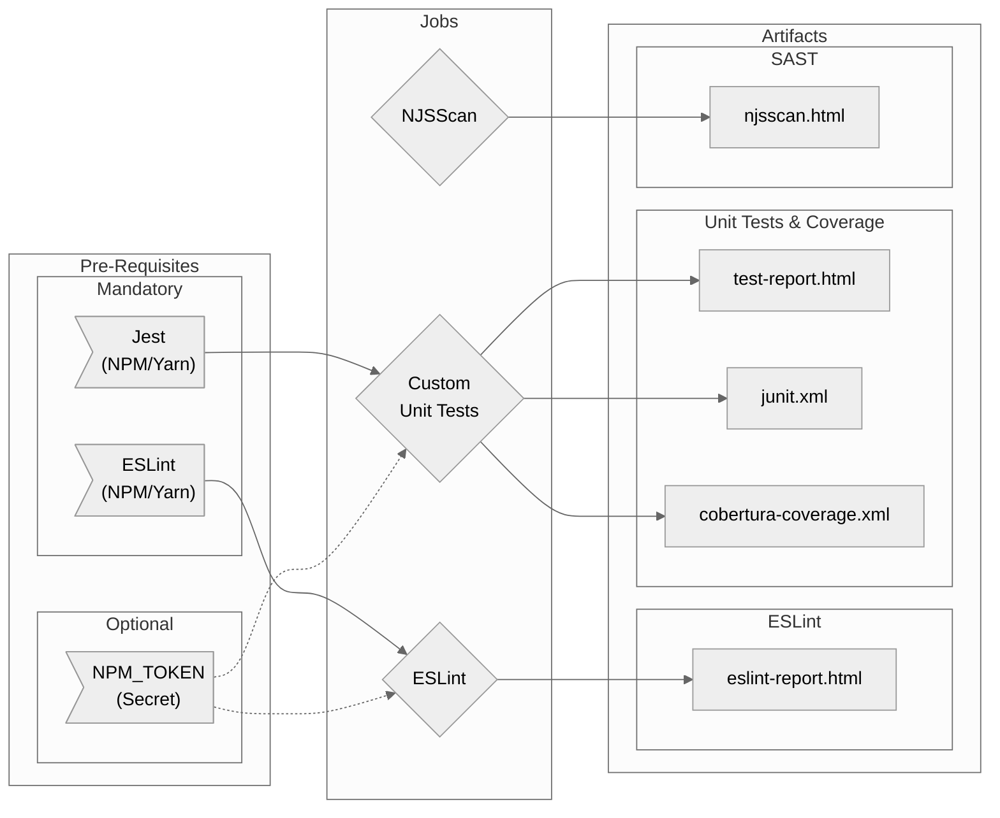

# Node-Tests Workflow Overview

## Purpose

This workflow will execute tests on your NodeJS application that require only the code (i.e. no deployed environment) using typical yarn or npm commands.

In general it will run Unit Tests, ESLint and NJSScan for the build.

!> The workflow itself will not provide the scripts and dependencies. It simply executes your commands and provide artifacts if the appropriate dependencies are installed and configured

- General
  - Configurable NodeJS version
  - All relevant jobs have the option to provide an NPM_TOKEN for authentication with private repositories
- ESLint
  - Provides HTML report if configured
- NJS Scan (SAST)
  - Provides a default configuration with the option to use your own
  - Provides an HTML report as an artifact
- Unit Tests
  - Provides HTML report and Code Coverage if configured

## Included Jobs



### ESLint

Runs an install and test script of your choice with the default being `yarn lint:ci`

**Uses:** N/A Your own NodeJS Scripts

### NJSScan

NJSScan is a static application testing (SAST) tool that can find insecure code patterns in your node.js applications using simple pattern matcher from libsast and syntax-aware semantic code pattern search tool semgrep.

**Uses:** [ajinabraham/njsscan-action@master](https://github.com/ajinabraham/njsscan-action)


### Unit Tests

Runs an install and test script of your choice with the default being `yarn test:unit-ci`

**Uses:** N/A Your own NodeJS Scripts

## Usage

Due to the nature of the jobs in this workflow, much of the configuration will happen in your Node project's configuration. See [Tips for Script Configuration](node-tests/README?id=tips-for-script-configuration)

Thus, the configuration options for the workflow are relatively simple. Given that you are providing the correct dependencies and scripts, then the simplest example is as follows:

```yaml
node-tests:
    uses: erzz/workflows/.github/workflows/node-tests.yml@main
```

Or if your dependencies rely on a private NPM repository:

```yaml
node-tests:
    uses: erzz/workflows/.github/workflows/node-tests.yml@main
    secrets:
      npm-token: ${{ secrets.ARTIFACTORY_AUTH_TOKEN }}
```

## Secrets

| Input                  | Required | Details                                                                                                   |
| ---------------------- | ---------| --------------------------------------------------------------------------------------------------------- |
| `npm-token`            | false    | If needing to authenticate with your NPM repository, provide the token which will be exposed as NPM_TOKEN |

## Inputs

| Input                    | Required | Default                 | Details                                                                               |
| ------------------------ | -------- | ----------------------- | ------------------------------------------------------------------------------------- |
| `node-version`           | false    | `16`                    | The version of NodeJS to use for your tests                                           |
| `install-command`        | false    | `yarn install --silent` | Used to override the default command to install your dependencies e.g. `yarn install` |
| `eslint-enable `         | false    | `true`                  | To disable the eslint job set to `false`                                              |
| `eslint-command`         | false    | `yarn lint:ci`          | Used to override the default command to execute ES Lint e.g. `yarn lint:ci`           |
| `njsscan-enable`         | false    | `true`                  | To disable the njsscan job set to `false`                                             |
| `njsscan-default-config` | false    | `true`                  | If you would rather use your own .njsscan configuration, set to false                 |
| `unit-test-enable`       | false    | `true`                  | To disable the unit-tests job set to `false`                                          |
| `unit-test-command`      | false    | `yarn test:unit-ci`     | Used to override the default command to run your unit tests e.g. `yarn test:unit-ci`  |

## Outputs

None

## Advanced Examples

### Using your own yarn commands

```yaml
node-tests:
    uses: erzz/workflows/.github/workflows/node-tests.yml@main
    with:
      install-command: 'npm ci'
      eslint-command: 'npx eslint --ext .jsx --ext .js lib/'
      unit-test-command: 'npm run test'
    secrets:
      npm-token: ${{ secrets.ARTIFACTORY_AUTH_TOKEN }}
```

## Tips for Script Configuration

It's difficult to give hard and fast rules about how your node project should be configured, but in order to produce the relevant artifacts something similar to below should be added.

> These are just examples! Hopefully you know what to do from there for your special :snowflake:snowflake:snowflake:

### ESLint HTML Report

To produce an HTML report in your ESLint test script you would use something like:

```json
"lint:ci": "eslint --ext .js,.ts,.vue . -f node_modules/eslint-html-reporter/reporter.js -o eslint-report.html"
```

### Unit Tests

To produce code coverage and HTML reports in your unit test script, you would use something like:

```json
"test:unit-ci": "jest --selectProjects unit --ci --runInBand --reporters jest-html-reporter jest-junit"
```

with a jest reporter configuration like:

```js
collectCoverage: true,
  coverageReporters: ['text', 'cobertura'],
  collectCoverageFrom: [
    '<rootDir>/components/**/*.vue',
    '<rootDir>/pages/**/*.vue',
    '<rootDir>/store/**/*.ts',
    '<rootDir>/utils/**/*.ts',
  ],
```
