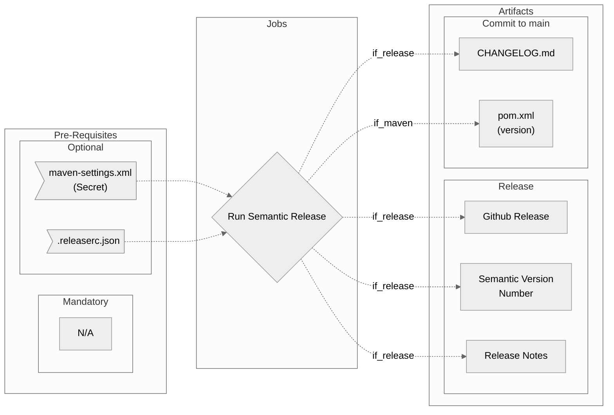

# Release Workflow Overview

## Purpose

This workflow will:

### General

- Analyze your semantic commit git history, and create a semantically versioned release if required
- If a release is created - produces release with release notes
- If a release is created - updates and commits `CHANGELOG.md` back to main branch
- Includes a [standard configuration](https://github.com/erzz/workflows/blob/main/.github/workflows/configs/semantic-release-config.json) with option to disable and use the config already in your repository.

### Maven Specific

- Options to switch to [maven version](https://github.com/erzz/workflows/blob/main/.github/workflows/configs/semantic-release-config-mvn.json) of the semantic-release configuration which also updates the version in `pom.xml`
- Option for a maven-settings.xml file to be created from a secret for authenticating with maven repositories

## Included Jobs



### Run Semantic Release

Runs Semantic Release to analyse commit history and decide on whether a release should be created. If a release is created it takes care of semantic versioning, release notes, CHANGELOG.md etc

**Uses:** [cycjimmy/semantic-release-action@v2.7.0](https://github.com/cycjimmy/semantic-release-action)

## Usage

Simply include the workflow within your project's workflow using something like the following.

?> `on.workflow_dispatch` in this example means you intend to run the workflow manually. You can just as easily add the job into an automated flow instead where the job would run automatically or any other combination of release process.

```yaml
name: Release
on: workflow_dispatch
jobs:
  release:
    uses: erzz/workflows/.github/workflows/semantic-release.yml@main
    secrets:
      token: ${{ secrets.RELEASE_TOKEN }}
```

## Secrets

| Input                 | Required | Details                                                                                             |
| --------------------- | -------- | --------------------------------------------------------------------------------------------------- |
| `token`               | true     | A secret containing a GITHUB_TOKEN with permissions to create releases, push directly to master etc |
| `maven-settings-file` | false    | If a maven settings file is required provide the secret containing the file                         |

## Inputs

| Input            | Required | Default | Details                                                                                        |
| ---------------- | -------- | ------- | ---------------------------------------------------------------------------------------------- |
| `default-config` | false    | `true`  | If you have your own .releaserc.json already in you project - set this input to `false`        |
| `mvn-settings`   | false    | `false` | Should combine with `default-config: false` and special pom.xml updating config will be used   |
| `dry-run`        | false    | `false` | Used to only preview the release result and notes for testing. Set to true to enable           |

## Outputs

| Output                | Description                                                   | Example value                          |
| --------------------- | ------------------------------------------------------------- | -------------------------------------- |
| new_release_published | Returns true if a release was created                         | `true`                                 |
| new_release_version   | The version given to the release if created                   | `v1.2.0`                               |
| new_release_notes     | The contents of the release notes if a release was created    | The full markdown of the release notes |
| `short-sha`           | Captures the short SHA for use in this or later workflow jobs | `cb26122`                              |
| `ref-slug`            | A URL sanitized version of the github ref                     | `bug-mybranch1`                        |

## Advanced Examples

### Use your own configuration

```yaml
release:
  uses: erzz/workflows/.github/workflows/semantic-release.yml@main
  with:
    default-config: false
  secrets:
    token: ${{ secrets.RELEASE_TOKEN }}
```

### Maven projects and using a maven settings file

With this combination of `mvn-settings: true` and `mvn-settings-file:` a special version of the workflow will run which will give the ability to both set a maven-settings file plus a semantic-release configuration that also updates pom.xml with the newly released version.

```yaml
release:
  uses: erzz/workflows/.github/workflows/semantic-release.yml@main
  with:
    default-config: false
    mvn-settings: true
  secrets:
    token: ${{ secrets.RELEASE_TOKEN }}
    mvn-settings-file: ${{ secrets.MAVEN_SETTINGS_FILE }}
```