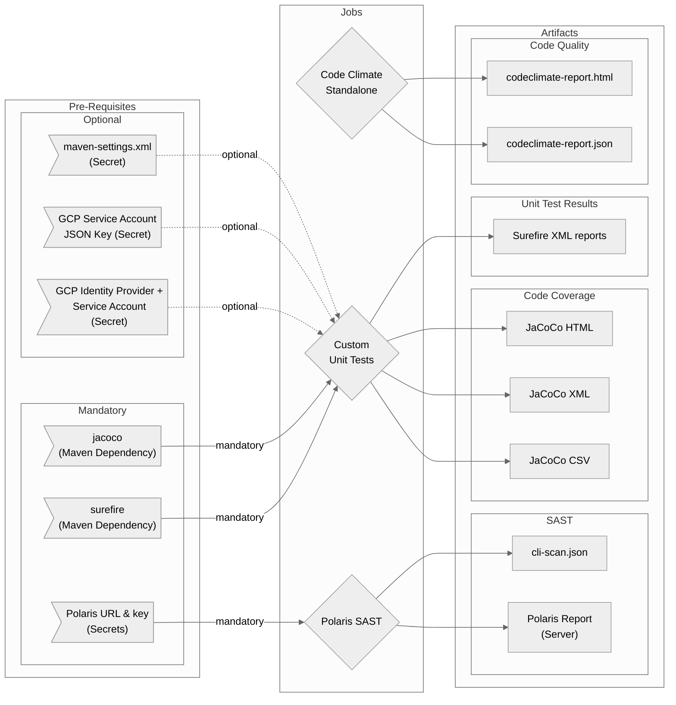

# Java-Tests Workflow Overview <!-- {docsify-ignore-all} -->

## Purpose

This workflow is, very specifically, based on a case where we are building a Maven application, possibly with a Maven settings file and possibly needing some GCP authentication elements during testing.

?>There may be other variations of this in the future - feel free to request!

In general it will run Unit Tests, Code Quality and SAST for the build.

- Code Quality using Code Climate in standalone mode
  - Default configuration or bring your own
  - Configurable Pass / Fail criteria
  - HTML report as artifact by default
- Polaris SAST Scan
  - Provides results analysis script to "break the build" on your own criteria
  - Option to include maven settings file
  - JSON report as an artifact
  - Optional usage of a maven-settings.xml
- Unit Tests
  - Option to provide GCP auth via SA key or OIDC
  - Configurable test command
  - Provides Surefire and Jacoco reports as artifacts
  - Optional usage of a maven-settings.xml

## Included Jobs

### Code Climate Standalone

Runs a version of Code Climate that requires no subscription or server connection. Just executes locally using either this workflow's configuration or you own to identify code quality, consistency and good practice.

**Uses:** [erzz/codeclimate-standalone@v0.0.3](https://github.com/erzz/codeclimate-standalone)

### Polaris SAST

!> This is a paid service and you will be expected to provide both the URL and an access key to send your results to Synopsis for analysis

SAST application that analyses your code for security issues and bad practices

**Uses:** N/A Scripted installation and execution in the workflow

### Unit Tests

!> You will need to provide your own tests. This job automates the execution of your `mvn test --fail-at-end -B` (or equivalent) command and produces reports plus coverage

Executes your Unit tests with a command of your choice and provides reports from Surefire plus Code Coverage from JaCoCo

Uses: N/A Scripted installation and execution in the workflow