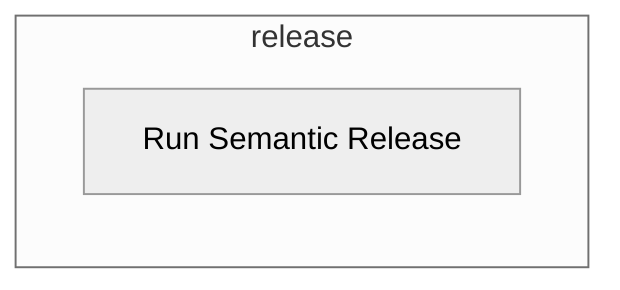

# Release Workflow Overview <!-- {docsify-ignore-all} -->

## Purpose

This workflow will:

### General

- Analyze your semantic commit git history, and create a semantically versioned release if required
- If a release is created - produces release with release notes
- If a release is created - updates and commits `CHANGELOG.md` back to main branch
- Includes a [standard configuration](https://github.com/erzz/workflows/blob/main/.github/workflows/configs/semantic-release-config.json) with option to disable and use the config already in your repository.

### Maven Specific

- Options to switch to [maven version](https://github.com/erzz/workflows/blob/main/.github/workflows/configs/semantic-release-config-mvn.json) of the semantic-release configuration which also updates the version in `pom.xml`
- Option for a maven-settings.xml file to be created from a secret for authenticate maven repos

## Included Jobs

### Run Semantic Release

Runs Semantic Release to analyse commit history and decide on whether a release should be created. If a release is created it takes care of semantic versioning, release notes, CHANGELOG.md etc

**Uses:** [cycjimmy/semantic-release-action@v2.7.0](https://github.com/cycjimmy/semantic-release-action)