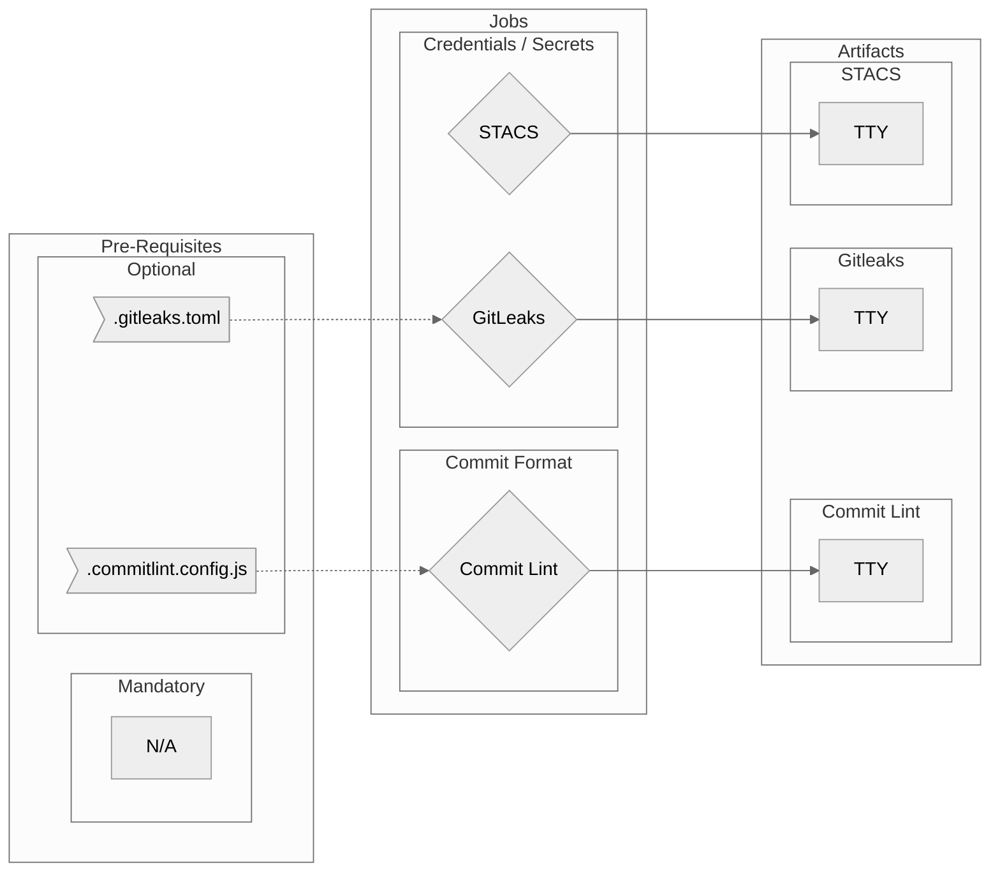

# Source Protection Workflow Overview <!-- {docsify-ignore-all} -->

## Purpose

This workflow will check your repo for:

- accidentally committed credentials and secrets
- optionally validate the commit history for adherence to conventional commit practices

!> This workflow is intended to be run early (from first push to a branch) in order to catch issues with your repository **EARLY** when they are easy to fix!

?> The workflow can of course be run at any time and I recommend that it runs also at least for main and possibly also pre-deployment to production too!

## Included Jobs

### Gitleaks

Runs Gitleaks which checks your repo for accidentally committed credentials

**Uses:** [zricethezav/gitleaks-action@v1.6.0](https://github.com/zricethezav/gitleaks-action)

### STACS

YARA powered static credential scanner which supports source code, binary file formats, analysis of 
nested archives, composable rule-sets and ignore lists

**Uses:** [stacscan/stacs-ci@0.1.1](https://github.com/stacscan/stacs-ci)

### Commit Lint

Scans the commit history to help your team adhere to a commit convention

**Uses:** [wagoid/commitlint-github-action@v4](https://github.com/wagoid/commitlint-github-action)