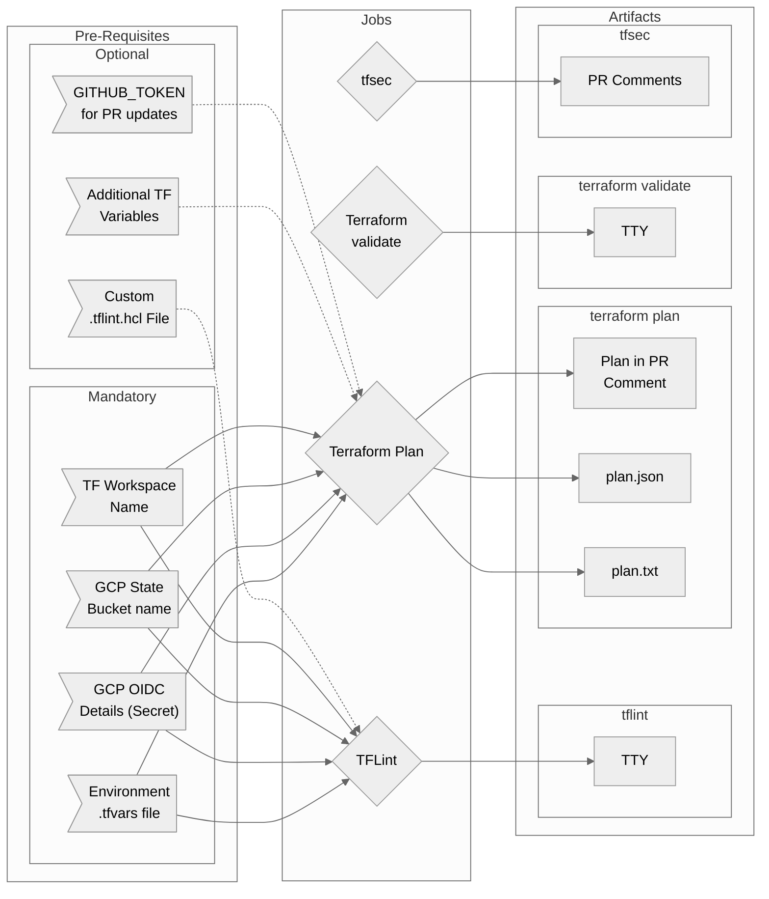

# Terraform Tests Workflow Overview

## Purpose

This workflow will run a suite of tests plus create a Terraform plan for a given environment.

Though the workflow will work with the vast majority of cases, it is built and tested in a context where the following are true:

- GCP is the target cloud provider
- OIDC authentication is utilised
- Terraform workspaces are used

If your specific case doesn't work, [Report an issue](https://github.com/erzz/workflows/issues) and we can improve compatibility or create a version for your context.

?> This workflow is designed to run when a PR is created. It will function as a push-based workflow too, but be sure to disable `pr-update` or the job will fail

- Tests
  - Uses tflint to look for possible errors, bad practices, deprecated syntax, etc
  - Uses `terraform validate` to validate syntax and consistency
  - Runs `tfsec` against your configuration to look for potentially insecure configurations
- Plan
  - Creates a plan for the environment
  - Optionally posts the plan to the PR as a comment for reviewers to check

## Included Jobs



### TFLint

Checks for possible errors, bad practices, deprecated syntax, etc using `tflint`

**Uses:**
- [google-github-actions/auth@v0.4.4](https://github.com/google-github-actions/auth)
- [terraform-linters/setup-tflint@v1](https://github.com/terraform-linters/setup-tflint)
- [hashicorp/setup-terraform@v1.3.2](https://github.com/hashicorp/setup-terraform)
- [dflook/terraform-new-workspace@v1](https://github.com/dflook/terraform-new-workspace)
- `tflint --config=.tflint.hcl --format=compact --module --var-file="$GITHUB_WORKSPACE/${{ inputs.varfile }}"`

### Terraform Plan

Generates a terraform plan based on the `.tfvars` and any additional vars provided. Optionally posts the plan to the PR (on by default) for review before merge.

**Uses:**
- [google-github-actions/auth@v0.4.4](https://github.com/google-github-actions/auth)
- [dflook/terraform-new-workspace@v1](https://github.com/dflook/terraform-new-workspace)
- [dflook/terraform-plan@v1](https://github.com/dflook/terraform-github-actions/tree/master/terraform-plan)


### Terraform Validate

Checks your terraform syntax for validity.

**Uses:** [dflook/terraform-validate@v1](https://github.com/dflook/terraform-validate)

### TFSec

Uses static analysis of your terraform templates to spot potential security issues. Using the GCP configuration plugin only at this point.

**Uses:** [aquasecurity/tfsec-pr-commenter-action@v0.1.10](https://github.com/aquasecurity/tfsec-pr-commenter-action)

## Usage

Given the nature of this workflow in it's current form, there will be several mandatory inputs/secrets to provide. 

!> Remember this workflow assumes that OIDC authentication is used between Github and GCP

?> You may wish to call this workflow several times, in the same pipeline, for different environments. See [Advanced Examples](terraform-tests/README?id=advanced-examples) for demonstrations of how to achieve this!

?> You may wish to call this workflow `on: push` rather than `on: pull_request`. In which case you will need to disable PR commenting. See [Advanced Examples](terraform-tests/README?id=advanced-examples) for demonstrations of how to achieve this!

The minimum configuration of this workflow for a given terraform environment would look something like:

```yaml
name: Terraform Tests
on: pull_request

# Required for OIDC
permissions:
  contents: read
  id-token: write

jobs:
  dev-tests:
    uses: erzz/workflows/.github/workflows/terraform-tests.yml@main
    with:
      path: terraform                                  # relative to your project root
      workspace: my-workspace                          # terraform workspace to use
      varfile: terraform/environments/staging.tfvars   # relative to your project root
    secrets:
      token: ${{ secrets.SOME_GITHUB_PAT }}            # Used to post plan to PR
      state-bucket: ${{ secrets.DEV_TF_STATE_BUCKET }} # The GCS bucket used as terraform state backend
      # Required for OIDC
      wip: projects/012345678901/locations/global/workloadIdentityPools/github/providers/github
      service-account: my-service-account@my-project.iam.gserviceaccount.com
```

## Secrets

| Input             | Required | Details                                                          |
| ----------------- | ---------| ---------------------------------------------------------------- |
| `wip`             | true     | The workload identity provider to use for authentication         |
| `service-account` | true     | The service account to impersonate via oidc                      |
| `state-bucket`    | true     | Name of the Google Storage bucket where state files are stored   |
| `token`           | false    | Provide a github token with permission to write to pull requests |

## Inputs

| Input                   | Required | Default      | Details                                                                                   |
| ----------------------- | -------- | ------------ | ----------------------------------------------------------------------------------------- |
| `path`                  | false    | `.`          | The path to your terraform configuration files (relative to the project root)             |
| `version`               | false    | `1.0.11`     | The version of terraform to utilise in the jobs                                           |
| `workspace`             | true     | N/A Required | Name of the terraform workspace to work in (will be created if doesn't exist)             |
| `varfile`               | true     | N/A Required | The path to the `.tfvars` file to use (relative to the project root)                      |
| `vars`                  | false    | `""`         | Add any additional or dynamice terraform variables. This should be valid terraform syntax |
| `tflint-default-config` | false    | `true`       | Change to false if you want to use your own `.tflint.hcl` config                          |
| `tfsec-version`         | false    | `latest`     | The version of tfsec to utilise                                                           |
| `pr-update`             | false    | `true`       | If you do not wish pull requests to be updated with the plan output, set to false         |
| `pr-label`              | false    | `""`         | Optional label for the environment name in the PR comment created by terraform-plan       |

## Outputs

| Output           | Description                                                                                  | Example value | Required TF version |
| ---------------- | -------------------------------------------------------------------------------------------- | --------------| ------------------- |
| `changes`        | Returns `true` if the plan would apply any changes, 'false' if it wouldn't.                  | `true`        | `>=0.11`            |
| `json-plan-path` | The path (relative to the Actions workspace) to the generated plan in JSON Output format.    | `plan.json`   | `>=0.13`            |
| `text-plan-path` | The path (relative to the Actions workspace) to the generated plan in human readable format. | `plan.txt`    | `>=0.13`            |

## Advanced Examples

### Using for on: push

As mentioned, the PR commenting will not work and cause a job result of failed if used with an on: push based workflow. To use in a push-based workflow disable `pr-update`
and you no longer need the `token` secret either

```yaml
name: Terraform Tests
on: push

# Required for OIDC
permissions:
  contents: read
  id-token: write

jobs:
  dev-tests:
    uses: erzz/workflows/.github/workflows/terraform-tests.yml@main
    with:
      path: terraform                                  # relative to your project root
      workspace: my-workspace                          # terraform workspace to use
      varfile: terraform/environments/staging.tfvars   # relative to your project root
      pr-update: false
    secrets:
      state-bucket: ${{ secrets.DEV_TF_STATE_BUCKET }} # The GCS bucket used as terraform state backend
      # Required for OIDC
      wip: projects/012345678901/locations/global/workloadIdentityPools/github/providers/github
      service-account: my-service-account@my-project.iam.gserviceaccount.com
```

### Dynamic Terraform variables

The option exists to pass terraform variables (using the `vars:` input) into the workflow which is useful for dynamic values and preview-environment types of cases. Note the input is multi-line (denoted by the `|`) and is terraform syntax exactly like that you would write into a `.tfvars` file.

```yaml
jobs:
  dev-tests:
    uses: erzz/workflows/.github/workflows/terraform-tests.yml@main
    with:
      path: terraform                                  # relative to your project root
      workspace: my-workspace                          # terraform workspace to use
      varfile: terraform/environments/staging.tfvars   # relative to your project root
      vars: |
        cr_image                  = "eu.gcr.io/my-project/${{ github.event.repository.name }}:next-version"
        environment_name          = "${{ github.ref_name }}"
        app_service_account_roles = {
          "datastore" : "roles/datastore.user",
          "cloudrun" : "roles/run.invoker"
        }
    secrets:
      token: ${{ secrets.SOME_GITHUB_PAT }}               # Used to post plan to PR
      state-bucket: ${{ secrets.DEV_TF_STATE_BUCKET }}    # The GCS bucket used as terraform state backend
      # Required for OIDC
      wip: projects/012345678901/locations/global/workloadIdentityPools/github/providers/github
      service-account: my-service-account@my-project.iam.gserviceaccount.com
```

### Multiple environments

As with all reusable workflows, you can call the same workflow multiple times with different inputs by simply ensuring each job has a unique name.

```yaml
jobs:
  # RUN TESTS & PLAN FOR MY DEV ENVIRONMENT
  dev-tests:
    uses: erzz/workflows/.github/workflows/terraform-tests.yml@main
    with:
      path: terraform                                  # relative to your project root
      workspace: my-workspace                          # terraform workspace to use
      varfile: terraform/environments/staging.tfvars   # relative to your project root
    secrets:
      token: ${{ secrets.RPIM_BOT_PAT }}               # Used to post plan to PR
      state-bucket: ${{ secrets.DEV_TF_STATE_BUCKET }} # The GCS bucket used as terraform state backend
      # Required for OIDC
      wip: projects/012345678901/locations/global/workloadIdentityPools/github/providers/github
      service-account: my-service-account@my-project.iam.gserviceaccount.com

  # RUN TESTS & PLAN FOR MY PRODUCTION ENVIRONMENT
  prod-tests:
    uses: erzz/workflows/.github/workflows/terraform-tests.yml@main
    with:
      path: terraform                                    # relative to your project root
      workspace: prod-workspace                          # terraform workspace to use
      varfile: terraform/environments/production.tfvars  # relative to your project root
    secrets:
      token: ${{ secrets.SOME_GITHUB_PAT }}              # Used to post plan to PR
      state-bucket: ${{ secrets.PROD_TF_STATE_BUCKET }}  # The GCS bucket used as terraform state backend
      # Required for OIDC
      wip: projects/987654321012/locations/global/workloadIdentityPools/github/providers/github
      service-account: my-service-account@my-prod-project.iam.gserviceaccount.com
```